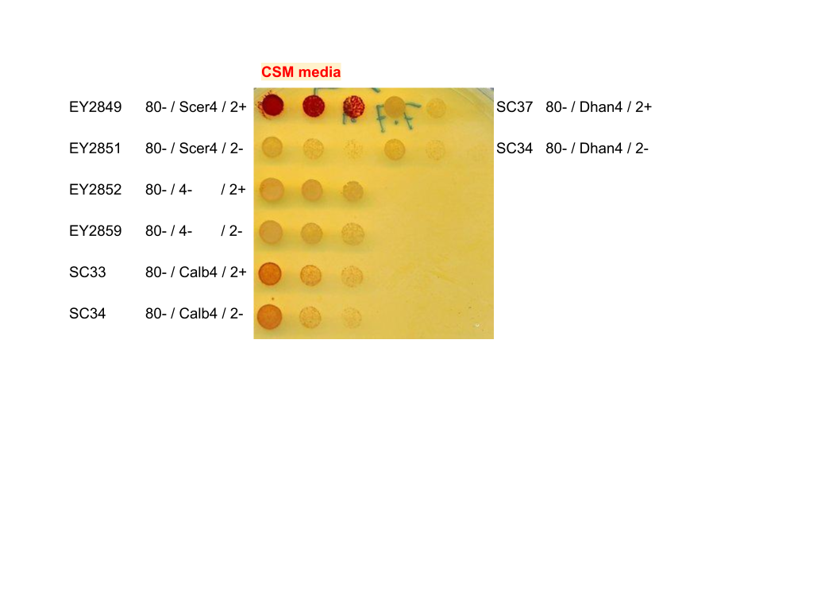

It was pointed out to us that the phosphatase assay images for _S. cerevisiae_ _pho4-_ and _pho2-_ appears to be the same. After checking the figure and the raw images, we realized that we did make a mistake when cropping the images for the figure. The raw full plate image is attached here and we are preparing a correction to be submitted to the journal.

