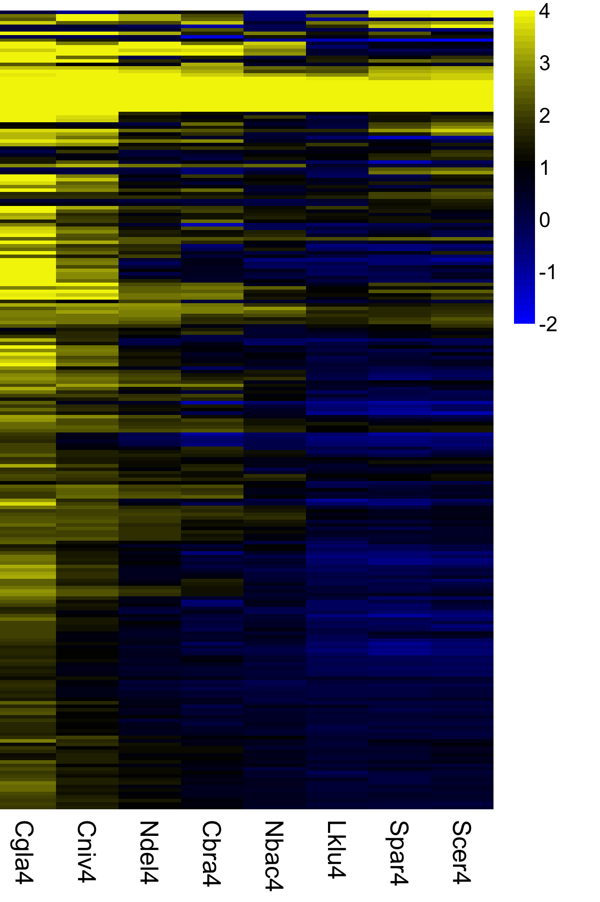
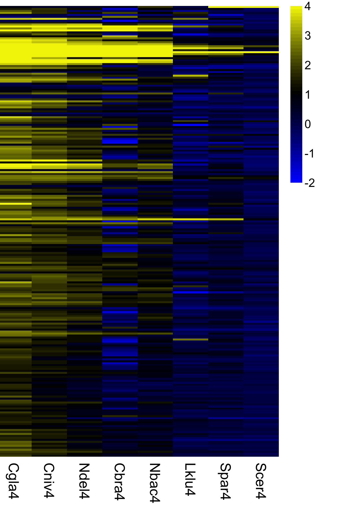
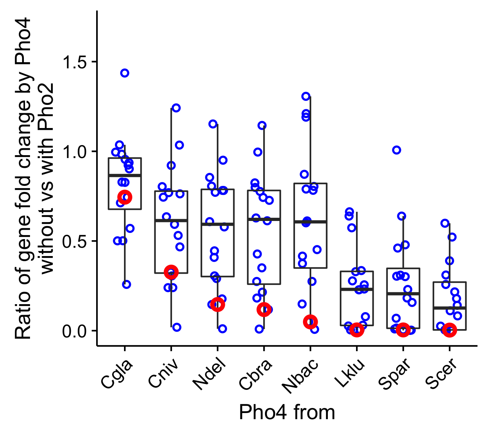
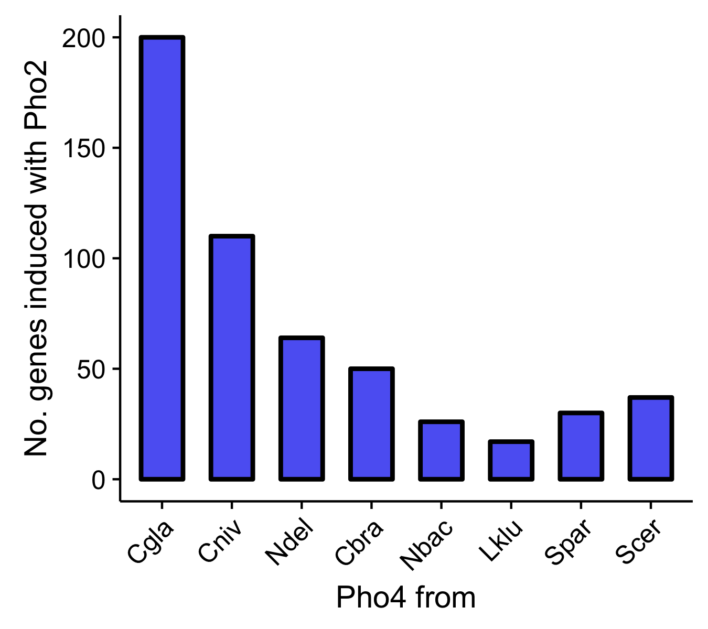
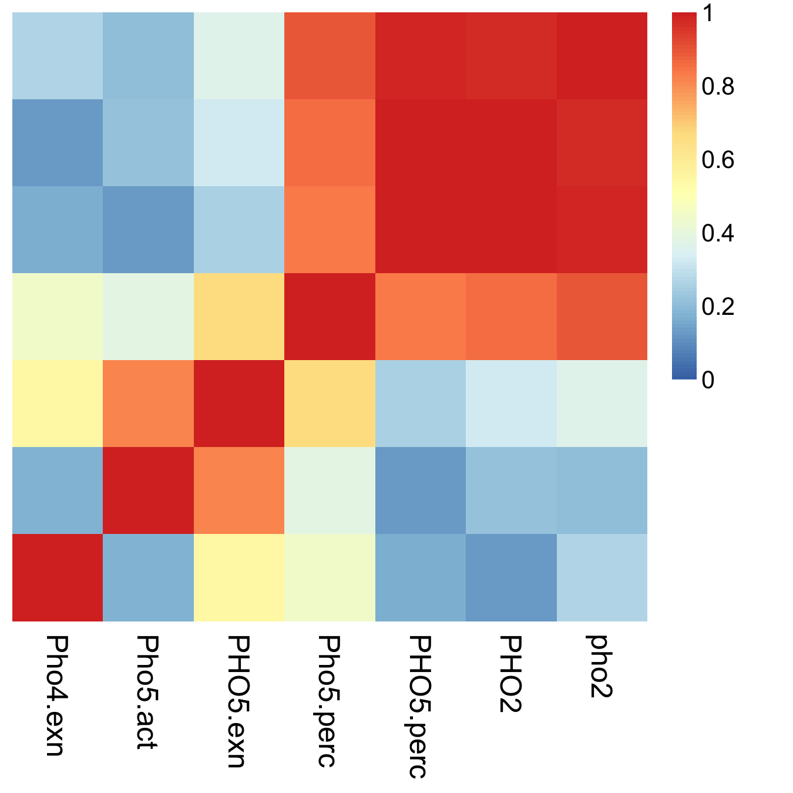

_Brief description_

This script takes in raw counts and determine Differential Expression (DE) for every gene of interest.

# Read data & Define functions

Load library packages...
```{r Load_library, cache=FALSE, message=FALSE}
library(ggplot2)      # general plotting
library(cowplot)      # Claus Wilco's modification on ggplot
library(plyr)         # for data frame manipulation
library(NMF)          # for plotting heatmaps
library(limma)        # for linear regression analysis
library(data.table)   # for handling large matrix/data.frame
library(RColorBrewer) # for color palette
#library(vsn)          # for plotting meanSdPlot
library(edgeR)        # for limma-voom workflow
library(GenomicRanges)# for GRanges object construction
## load subfunctions
source("RNAseq_subfunctions.R")
## load annotation files
source("./input/useful_anno_Robj.R")
```


# RNAseq analysis

## Data processing

### Load data

```{r load_data, comment=NA, cache = FALSE}
# raw data count (countTable)
raw <- fread("./input/20170119_ScerRNAseq_count.csv") # 6383 genes, 36 samples, first column is gene name
mat <- as.matrix(raw[,-1])  # convert to matrix
rownames(mat) <- raw$ORF

# sample information (colData) for ScerRNAseq dataset
sample.info <- fread("./input/20170119_ScerRNAseq_sample_info.csv")
## order the sample info table according to the colnames of mat
setkey(sample.info, Sample) # sort data.table by Sample
sample.info <- sample.info[colnames(mat)] # reorder data.table based on data matrix column order
#sample.info[,GT := factor(GT, levels = unique(GT))]
## double check
if( any(colnames(mat) != sample.info$Sample) )
  warning("Order of sample information table is incorrect.")

print(sample.info)

# gene annotation file
anno.file <- fread("./input/S_cerevisiae_gene_for_mapping_2016.txt")
names(anno.file) <- c("GeneID","Strand","Chr","Start","End","GeneName")
anno <- anno.file[,.(Chr,GeneID,GeneName)] # extract just chromosome name, GeneID and Gene Name
anno.gr <- with(anno.file, GRanges(seqname=Chr, ranges=IRanges( start=Start, end=End ), strand=Strand, geneID=GeneID, geneName=GeneName)) # make a GRanges object
names(anno.gr) <- mcols(anno.gr)$geneID

all.genes <- anno.file$GeneName; names(all.genes) <- anno.file$GeneID # useful for gene name to gene ID conversion
```

### Filtering

 Using count per million > 1 in at least 3 samples as a criteria

```{r limma_filter_n_normalize}
# construct count matrix using the edgeR package
dge.all <- DGEList( counts = mat, genes = anno )

# keep genes that have more than 1 count per million in at least 3 samples
isexpr <- rowSums(cpm(dge.all) > 1) >= 3 # excluded 697 genes
sprintf("%d genes were removed from the dataset due to low reads count", sum(!isexpr))

# exclude tRNA genes, which are polyadenylated only for degradation
# also exclude PHO4 and PHO2 since these two genes are deleted in half of the strains
exclude <- grepl( "^t", names(all.genes) ) | names(all.genes) == "YFR034C" | names(all.genes) == "YDL106C"

# filter data
dge <- dge.all[isexpr & !exclude,,keep.lib.sizes=FALSE]

#prepare dataset: use TMM method to normalize
dge <- calcNormFactors(dge)
```

### Data transformation to remove mean-variance dependency
 
```{r limma_voom_transformation, fig.height=5, fig.width=10}
# construct design matrix
design <- model.matrix(~0+GT, sample.info) # 36 x 18 matrix. The rows in the design matrix correspond to the columns in the data matrix "mat". Make sure that they match each other.
colnames(design) <- sub("GT", "", colnames(design))

oldpar <- par(mfcol = c(1,2))
# apply voom transformation, plot mean-variance trend
v.dge <- voom( dge, design, plot = TRUE )
# clustering samples
plotMDS(v.dge)
par(oldpar)

# fit the linear model. the 'fit' object is to be used to extract particular "contrasts". See below
fit <- lmFit(v.dge, design)
```

### Linear Model fitting to identify differentially expressed genes

```{r linear_model_fitting}
#  the goal is to identify genes induced by each of the eight Pho4 orthologs with or without ScPho2, and compare their numbers and the extent of overlaps (Figure 3A,B)
contrast.step1 <- makeContrasts(
  # Scer4
  Scer4.alone = Scer4.del2.a - del4.del2.a,
  Scer4.w.sc2 = Scer4.Scer2.a - del4.Scer2.a,
  # Cgla4
  Cgla4.alone = Cgla4.del2 - del4.del2.a,
  Cgla4.w.sc2 = Cgla4.Scer2 - del4.Scer2.a,
  # Cbra4
  Cbra4.alone = Cbra4.del2 - del4.del2.a,
  Cbra4.w.sc2 = Cbra4.Scer2 - del4.Scer2.a,
  # Cniv4
  Cniv4.alone = Cniv4.del2 - del4.del2.a,
  Cniv4.w.sc2 = Cniv4.Scer2 - del4.Scer2.a,
  # Kbac4
  Nbac4.alone = Nbac4.del2 - del4.del2.a,
  Nbac4.w.sc2 = Nbac4.Scer2 - del4.Scer2.a,
  # Kdel4
  Ndel4.alone = Ndel4.del2 - del4.del2.a,
  Ndel4.w.sc2 = Ndel4.Scer2 - del4.Scer2.a,
  # Spar4
  Spar4.alone = Spar4.del2.a - del4.del2.a,
  Spar4.w.sc2 = Spar4.Scer2.a - del4.Scer2.a,
  # Sklu4
  Lklu4.alone = Lklu4.del2.a - del4.del2.a,
  Lklu4.w.sc2 = Lklu4.Scer2.a - del4.Scer2.a,
  # end specifying contrasts
  levels = design  
)
# extract the "contrasts"
fit.step1 <- contrasts.fit( fit, contrast.step1 )
# hypothesis testing for all genes and all contrasts simultaneously, making the criteria consistent across all comparisons.
## H~0~: fold change < 2
## H~1~: fold change >= 2
fit.step1 <- treat( fit.step1, lfc = 1 )
## identify significantly differentially expressed genes, with p-values <= 0.05, adjusted for multiple testing
sig.step1 <- decideTests( fit.step1, p.value = 0.05, method = "global" )
## uncomment the line below to see a summary of the number of DE genes per contrast. -1: down; 1: up
# t( summary( sig.step1 )[c(1,3),] )
```

## Generate Figure 3A,B (heatmap)

```{r Figure3_AB}
# indices to choose either the coefficients with ScPho2 or without
C.w.sc2 <- seq(2,16,by=2); C.alone <- seq(1,15,by=2) 
# select genes that are significantly induced by at least one of the eight Pho4 orthologs with ScPho2 present
use <- apply( sig.step1[,C.w.sc2], 1, function(t) sum(t == 1) >= 1 ) # 229 genes selected

colour <- colorRampPalette( c("blue", "black", "yellow"), space="rgb")(64) # for plotting

# first compare fold change among the union of all "w.sc2" significant genes
what <- coef(fit.step1)[use, C.w.sc2]
## apply cutoff on data for visualization purposes
what <- ifelse(what > 4, 4, ifelse(what < -2, -2, what))
## Reorder the columns according to Pho2 dependence determined by phosphatase assays (Figure 2)
column.order <- paste(c("Cgla","Cniv","Ndel","Cbra","Nbac","Lklu","Spar","Scer"),"4.w.sc2",sep="")
what <- what[,column.order]
## Shorten the column names
colnames(what) <- substr(colnames(what),1,5)
od <- aheatmap( what, color = colour, breaks = 1, border_color = NA, hclustfun = "single", revC = TRUE, Rowv = FALSE, Colv = NA, labRow = NA, cellwidth = 30 , filename = "./figure_output/Figure_3A.png", width = 4, height = 6 )

# next, look at the same set of genes as above, but with fold changes by XXX4.alone
what1 <- coef(fit.step1)[use, C.alone]
what1 <- ifelse(what1 > 4, 4, ifelse(what1 < -2, -2, what1))
column.order1 <- paste(c("Cgla","Cniv","Ndel","Cbra","Nbac","Lklu","Spar","Scer"),"4.alone",sep="")
what1 <- what1[,column.order1]
colnames(what1) <- substr(colnames(what1),1,5)
aheatmap( what1, color = colour, breaks = 1, border_color = NA, labRow = NA, Rowv = rev(od$rowInd), Colv = NA, cellwidth = 30, filename = "./figure_output/Figure_3B.png", width = 4, height = 6) 

# dump the data used to generate this plot to a csv as Figure 3 source data
sps.order <- c("Cgla4","Cniv4","Ndel4","Cbra4","Nbac4","Lklu4","Spar4","Scer4")
what <- coef(fit.step1)[use, C.w.sc2]
colnames(what) <- substr(colnames(what),1,5)
what <- what[,sps.order]
write.table(what, file = "./table_output/Figure_3_source_data_gene_fold_with_ScPho2.tsv", quote = F, row.names = T, sep = "\t")

what1 <- coef(fit.step1)[use, C.alone]
colnames(what1) <- substr(colnames(what1),1,5)
what1 <- what1[,sps.order]
write.table(what1, file = "./table_output/Figure_3_source_data_gene_fold_no_ScPho2.tsv", quote = F, row.names = T, sep = "\t")

sig <- sig.step1[use, C.w.sc2] > 0
colnames(sig) <- substr(colnames(sig),1,5)
sig <- sig[,sps.order]
write.table(sig, file = "./table_output/Figure_3_source_data_gene_sig_with_ScPho2.tsv", quote = F, row.names = T, sep = "\t")

sig1 <- sig.step1[use, C.alone] > 0
colnames(sig1) <- substr(colnames(sig1),1,5)
sig1 <- sig1[,sps.order]
write.table(sig1, file = "./table_output/Figure_3_source_data_gene_sig_no_ScPho2.tsv", quote = F, row.names = T, sep = "\t")
```

  


## Generate Figure 3C,D

```{r figure3_CD}
# the goal is to assess the level of dependence in gene induction for each Pho4 ortholog, and evaluate the correlation between the average level of dependence (at gene level) and the total number of genes induced by each Pho4 ortholog
# Note that the second measure, i.e. total number of genes induced with Pho2, only uses information from the PHO2 wt background, while the ratio of gene expression w/o Pho2 vs with Pho2 uses information from two backgrounds, any correlation between these two variables should reflect real biological correlations.

## ---- Ratio of gene expression --

C.w.sc2 <- seq(2,16,by=2); C.alone <- seq(1,15,by=2) 
s.core <- apply(sig.step1[,C.w.sc2], 1, function(t) (sum(t) == 8)) # choose a subset of 16 genes induced by all eight Pho4 orthologs for the subsequence analysis

# build vector containing log2 fold change for genes in selected contrasts
# here z.PHO2 and z.pho2 are two matrices with n=length(s.core) rows and 8 columns. z.delta is the difference between the two, and 2^z.delta has the meaning of % gene expression without Pho2 vs with Pho2. The goal now is to make a data.frame with three variables: species | z.delta | significance
z.PHO2 <- coef(fit.step1)[s.core,C.w.sc2]
z.pho2 <- coef(fit.step1)[s.core,C.alone]
z.delta <- z.pho2 - z.PHO2; colnames(z.delta) <- substr(colnames(z.delta),1,5)

# now count the number of upregulated genes by each Pho4 ortholog with ScPho2
use <- apply( sig.step1[,C.w.sc2], 1, function(t) sum(t == 1) >= 1 ) # 229 genes selected
count.PHO2 <- colSums( sig.step1[use,C.w.sc2] == 1 )
names(count.PHO2) <- substr(names(count.PHO2), 1, 5)

# order the species factor, based on the level of dependence on Pho2 by phosphatase assay
species <- c("Cgla4","Cniv4","Ndel4","Cbra4","Nbac4","Lklu4","Spar4","Scer4")

# plotting Figure 3C
# define summary stat function
stat_sum_df <- function(fun, geom="crossbar", ...) {
  stat_summary(fun.data=fun, colour="red", geom=geom, width=0.2, ...)
}

# define data frame
d.delta1 <- data.frame( species = rep(substr(colnames(z.PHO2),1,4), each = nrow(z.delta)), genes = rep(names(s.core)[s.core], times = ncol(z.delta)), delta = c(z.delta) )
d.delta1$species <- factor(d.delta1$species, levels = substr(species,1,4))

# define a second data frame just for plotting PHO5
df <- data.frame( species = factor(species, levels = species, labels = substr(species, 1, 4)), ratio = 2^z.delta["YBR093C", species] )

p1 <- ggplot( d.delta1, aes( species, 2^delta ) ) + geom_jitter( width = 0.2, shape = 21, color = "blue", fill = NA, size = 1.5, stroke = 1 ) + geom_boxplot( outlier.colour = NA, fill = NA, width = 0.7 ) + labs( x = "Pho4 from", y = "Ratio of gene fold change by Pho4\nwithout vs with Pho2") + theme( axis.text.x = element_text( angle = 45, hjust = 1, vjust = 1 ))

## add Pho5 case to the plot
p1 <- p1 + geom_point( data = df, aes( species, ratio ), shape = 21, color = "red", fill = NA, alpha = 1, size = 2, stroke = 2 ) + ylim(c(0,1.7)) + guides( color = guide_legend() )
## save plot
ggsave("./figure_output/Figure_3C.png", plot = p1, width = 4.5, height = 4, units = "in", dpi = 300, bg = "transparent")

## plotting figure 3D
## define data frame for No. genes induced w. Pho2
df <- data.frame( species = factor(species, levels = species, labels = substr(species,1,4)), count = count.PHO2[species] ) 

p2 <- ggplot( data = df, aes(x = species, y = count ) ) + geom_bar( stat = "identity", width = 0.6, color = 1, fill = "blue2", alpha = 0.7, size = 1 ) + labs( x = "Pho4 from", y = "No. genes induced with Pho2") + theme( axis.text.x = element_text( angle = 45, hjust = 1, vjust = 1 ))

ggsave("./figure_output/Figure_3D.png", width = 4.5, height = 4, units = "in", dpi = 300, bg = "transparent")
```

  

## Generate Figure 3-figure supplement 1

```{r figure3_S1, fig.height=5, fig.width=5}
# b. load data
raw <- fread("./input/20161031_validate_strain_combined.csv")
# b.1 choose genes to use
genes <- unique(raw$Gene)
control <- paste("Scer",c("ACT1","ALG9","HEM2","RPN2"),sep = "")
notuse <- c("Lelo4","Suva2","Smik4","Smik2")
genes1 <- setdiff(genes, notuse)
# b.2 choose samples to use
samples <- unique(raw$Sample)
remove <- c(grep("lane",samples),grep("LH",samples))
samples1 <- samples[-remove]
# b.3 build the matrix
mat <- matrix(0, nrow = length(genes1), ncol = length(samples1), dimnames = list(genes1, samples1))
for( i in 1:nrow(raw) ){
  tS <- raw[i,Sample]
  tG <- raw[i,Gene]
  if( tS %in% samples1 && tG %in% genes1 ){
    mat[tG,tS] <- raw[i,Count]
  }
}

# c. normalize

# c.1 calculate geometric mean for all the control genes
control.mat <- mat[control,]
geom.mean <- apply(control.mat, 1, function(x) exp(mean(log(x))))

# c.2 calculate the size factors as the mean of ratios between the count of gene x in sample i and the geometric mean for gene x across samples
ratios <- control.mat / geom.mean
sizefactor <- apply(ratios, 2, median)

# c.3 normalize the count matrix by dividing the count for each gene in a sample by the sample-specific size factor
normalized <- mat;
for( i in 1:nrow(mat) ){
  normalized[i,] = mat[i,] / sizefactor
}

# d. process results
res <- t(round(ifelse(normalized > 50, normalized, NA),0)) # all raw data
res1 <- res[,-c(3:6)] # remove reference genes
# the chunk of code below is to produce the desired table
res2.pho4 <- res1[,!colnames(res1) %in% c("Scer2","Cgla2")]
cat("Now let's create a vector that stores the normalized counts for Pho4.")
cat("None of the strains has more than one Pho4 ortholog detected.")
sum( apply(res2.pho4, 1, function(i) sum(!is.na(i))) > 1 )
x <- unlist(apply( res2.pho4, 1, function(i)    # x: Pho4 read
  ifelse(sum(!is.na(i)) == 1, na.omit(i), 0) )) # counts
y <- unlist(apply( res2.pho4, 1, function(i){   # y: Pho4 from
  ii <- which(!is.na(i))                        # which species
  ifelse(length(ii) == 0, "pho4", colnames(res2.pho4)[ii])
}))
z <- c(rep("2016b",18),rep("2016a",12),rep("2013",34)) # z: exp date
res2 <- data.frame( group = z, PHO4 = y, nPho4 = x, nPho2 = res1[,"Scer2"] )
res2 <- res2[order(rownames(res2)),]
res2$PHO4 <- relevel(res2$PHO4, "pho4")
levels(res2$PHO4)[6:7] <- c("Kbac4","Kdel4")
res3 <- droplevels(subset( res2, group != "2016a" )) # data 2016a was not used in RNAseq analysis
res3$PHO4 <- factor(res3$PHO4, levels = c("pho4","Cgla4","Cniv4","Kdel4","Cbra4","Kbac4","Sklu4","Spar4","Scer4"), labels = c("pho4","Cgla4","Cniv4","Ndel4","Cbra4","Nbac4","Lklu4","Spar4","Scer4"))
res4 <- droplevels(subset(res3, PHO4 != "pho4")) # for calculating mean of Pho4 orthologs exn level
res4$nPho4.c <- res4$nPho4 - mean(res4$nPho4) # centered for ANOVA analysis

# e. plot results
p <- ggplot( res3, aes( PHO4, nPho4 ) ) + geom_point( shape = 21, size = rel(2), colour = 2 ) + stat_summary(fun.y = "mean", geom = "point", colour = "black", shape = 95, size = rel(8))
p <- p + geom_hline( yintercept = mean(res4$nPho4), linetype = 2 )
p + theme( axis.text.x = element_text( angle = 45, hjust = 1, vjust = 1 ) ) + labs(list(x="Pho4 from", y="normalized read counts (a.u.)", colour = "Exp. date"))
ggsave("./figure_output/Figure_3S1.png", width = 4.5, height = 4, units = "in", dpi = 300, bg = "transparent")

# f. F test
lmod <- lm( nPho4.c ~ PHO4 - 1, res4 )
summary(lmod)
```

## Generate Figure 3-figure supplement 2

```{r figure3_S2}
z.PHO2 <- coef(fit.step1)[use,C.w.sc2]; z.pho2 <- coef(fit.step1)[use,C.alone]
count.PHO2 <- colSums( z.PHO2 > 1 & sig.step1[use,C.w.sc2]) # No. of genes activated with PHO2
count.ovlp <- colSums( z.PHO2 > 1 & z.pho2 > 1 & sig.step1[use,C.w.sc2] & sig.step1[use,C.alone]) # No. of genes induced without Pho2
PHO5.exn <- 2^(z.PHO2["YBR093C",])
perc.PHO5.exn <- 2^(z.pho2["YBR093C",] - z.PHO2["YBR093C",])  # independent index, measured by the PHO5 liquid phosphatase assay, in the form of ratio between PHO4 induction of PHO5 without vs. with PHO2
Pho5.liquid <- c(Scer4 = 3.70, Cgla4 = 3.16, Cbra4 = 3.70, Cniv4 = 4.25, Kbac4 = 1.82, Kdel4 = 5.19, Spar4 = 3.01, Sklu4 = 2.85)
perc.Pho5.liquid <- c(Scer4 = 0.0091, Cgla4 = 0.50, Cbra4 = 0.19, Cniv4 = 0.61, Kbac4 = 0.027, Kdel4 = 0.18, Spar4 = 0, Sklu4 = 0.00314)
pho4.exn.level <- c(Scer4 = 498, Cgla4 = 763, Cbra4 = 1215, Cniv4 = 1037, Kbac4 = 806, Kdel4 = 801, Spar4 = 555, Sklu4 = 877)

# now assemble everything together
Pho4.names <- c("S. cerevisiae", "C. glabrata", "C. bracarensis", "C. nivarensis", "N. bacillisporus","N. delphensis", "S. paradoxus", "L. kluyveri")
df <- data.frame( Pho4 = Pho4.names, Pho4.exn = pho4.exn.level, Pho5.act = Pho5.liquid, PHO5.exn = PHO5.exn, Pho5.perc = perc.Pho5.liquid, PHO5.perc = perc.PHO5.exn, PHO2 = count.PHO2, pho2 = count.ovlp )
#df <- mutate( df, Percent.Ovlp = Overlap / PHO2 )

cov.mat <- cor(df[,-1])
#labels <- c("PHO4 expression level", "No. genes w/ Pho2", "No. genes w/o Pho2", "Phosphatase activity\nw/ Pho2", "  Phosphatase activity\nwith vs w/o Pho2", "PHO5 expression level\nwith vs w/o Pho2")
aheatmap( cov.mat, breaks = seq(0,1,by=0.01), Rowv = NA, Colv = NA, revC = FALSE, labRow = NA, filename = "./figure_output/Figure_3S2.png", width = 4.5, height = 4.5 )
```



# ChIP-seq analysis

## Data processing

## Generate Figure 4B

_Goal_

This chunk of code produces Figure 4B. The goal of the analysis is to assess ScPho4 and CgPho4 ChIP occupancy with and without ScPho2, so as to reveal their differential dependence on Pho2 for associating with DNA.

```{r compare_ratio_binding_wo2_vs_w2, fig.height=5, fig.width=5}
# Read in occupancy data
myOccu <- fread("./input/20170107_Pho4_occupancy_max_within_201609_filtered_peaks.csv", header = TRUE)
# Assemble data frame for plotting
R.Scer4 <- data.frame(PHO4 = "S. cerevisiae", ratio = myOccu[B_ScPho4==1, Ratio_ScPho4])
# try three versions of R.Cgla4
R.Cgla4 <- data.frame(PHO4 = "C. glabrata", ratio = myOccu[B_CgPho4==1, Ratio_CgPho4])

# use IP2, see notes above this section for reasoning.
R.plot <- rbind(R.Scer4, R.Cgla4)

p <- ggplot( R.plot, aes( PHO4, -log2(ratio) ) ) + geom_jitter( width = 0.3, shape = 21, fill = NA, size = 1.5, stroke = 1, alpha = 0.7 ) + stat_sum_df("mean_cl_boot") + geom_abline( intercept = 0, slope = 0, linetype = 2, size = 0.5 )

p + ylim(c(-6,3)) + labs( x = "Pho4 from", y = "log2 fold reduction in Pho4 binding/nwtihout vs with ScPho2") + theme( axis.title.y = element_text( size = rel(0.8) ), axis.title.x = element_text( size = rel(0.9) ), axis.text.x = element_text(face="italic"), plot.margin = unit(c(5,5,10,20), "pt") ) 
ggsave(file = "./figure_output/Figure_4B.png", width = 3.8, height = 3.5, units = "in", dpi = 300, bg = "transparent")

t.test(-log2(ratio)~PHO4, data = R.plot)
```

## Generate Figure 4C and Figure 4-figure supplement 1

_Goal_

Evaluate whether there is any difference in these properties between sites bound by both ScPho4 and CgPho4, vs ones bound only by CgPho4

```{r Nucleosome_Cbf1_occupancy_at_CgPho4_only_sites, fig.height=5, fig.width=10}
## the first step is to import the nucleosome and cbf1 occupancy data from Zhou & O'Shea 2011 supplementary data

#1. Load Xu's mmc2 table
xu.mmc2 <- read.table("./input/20160903_mmc2_Zhou_2011_data_in_Sac03.csv",header = TRUE, as.is = TRUE, sep = "\t")
names(xu.mmc2)[32:33] <- paste(c("Pho4","Pho2"),"Recruitment.no.vs.hiPi",sep = ".")
# remove rows with no ChIP data
xu.mmc2 <- subset(xu.mmc2, Alignability != 0)

#2. Construct GRanges for Xu's data
## the purpose here is to extract the nucleosome and Cbf1 occupancy data from the published dataset (Zhou & O'Shea 2011), by intersecting that dataset with my own ChIP identified binding sites.
xu.gr <- with(xu.mmc2, GRanges(seqnames = CHR, ranges = IRanges(Location,Location), Bound4 = (Pho4.binding.No.Pi == 1)) ) # convert the table into a GRanges object
xu.gr <- resize( xu.gr, fix = "center", width = 500 ) # resize the objects to be 500 bp

## My ChIP identified binding sites for ScPho4
my.gr <- with(subset(myOccu, B_ScPho4 == 1), GRanges( seqnames = SEQ_NAME, ranges = IRanges(start = START, end = END))) # construct GRanges for my data
my.gr.sc4.ori <- my.gr # preserve the original nonreduced
cat("Apply reduce on my list to count the number of non-overlapping binding events")
my.gr.sc4 <- reduce( my.gr ) # reduce() merges overlapping regions, because my data were merged
print( length(my.gr.sc4) ) # length of merged dataset

## My ChIP identified binding sites for CgPho4
my.gr <- with(subset(myOccu, B_CgPho4 == 1), GRanges( seqnames = SEQ_NAME, ranges = IRanges(start = START, end = END))) # construct GRanges for my data
cat("Apply reduce on my list to count the number of non-overlapping binding events")
my.gr.cg4.ori <- my.gr # preserve the original nonreduced
my.gr.cg4 <- reduce( my.gr )
print( length(my.gr.cg4) ) # length of merged dataset

# merge my table with Xu's
tmp <- as.data.table(xu.mmc2)
# add columns for my ChIP binary call for both Scer4 n Cgla4
match.sc4 <- countOverlaps( xu.gr, my.gr.sc4, type = "any" )
tmp$ScPho4.bound <- match.sc4 != 0
match.cg4 <- countOverlaps( xu.gr, my.gr.cg4, type = "any" )
tmp$CgPho4.bound <- match.cg4 != 0
tmp[, group := ScPho4.bound + CgPho4.bound*2]
tmp$group <- factor(tmp$group, levels = 0:3, labels = c("Neither","ScPho4 only","CgPho4 only","Both"))

# 1. plot _nucleosome occupancy_ under high Pi conditions, stratified by Scer4 and Cgla4 bound state
#   the logic is, I will examine either nucleosome or Cbf1 occupancy _without_ Pho4 in the nucleus to compete. This way I can tell if CgPho4 bound only sites tend to have higher competitor occupancy.

p1 <- ggplot( tmp[group != "ScPho4 only",], aes(group, Nucleosome.High.Pi/100) ) + geom_jitter( width = 0.3, shape = 21, color = "black", fill = NA, size = 1.5, stroke = 1, alpha = ifelse(tmp[group != "ScPho4 only",group] == "Neither", 0.4, 0.8) ) + stat_sum_df("mean_cl_boot") + xlab("Bound by ScPho4 / CgPho4") + ylab("Nucleosome occupancyin high Pi")

ggsave("./figure_output/Figure_4C.png", plot = p1, width = 4.5, height = 4, units = "in", dpi = 300, bg = "transparent")

#   t-test for population mean
tmp1 <- tmp[group %in% c("CgPho4 only","Both")]
tmp1 <- droplevels(tmp1)
t.test(Nucleosome.High.Pi~group, data = tmp1)

# 2. plot Cbf1 occupancy under High Pi conditions among the most accessible 25% of E-box motifs as determined by Nucleosome occupancy measured under high Pi condition

accessible <- tmp[Nucleosome.High.Pi <= quantile( Nucleosome.High.Pi, prob=0.25 ) & Cbf1.Enrichment.High.Pi != 0]

p2 <- ggplot( accessible[group != "ScPho4 only"], aes(group, log10(Cbf1.Enrichment.High.Pi)) ) + geom_jitter( width = 0.3, alpha = ifelse(accessible[group != "ScPho4 only",group] == "Neither", 0.7, 0.9), shape = 21, color = "blue", fill = NA, size = 1.5, stroke = 1 ) + stat_sum_df("mean_cl_boot") + xlab("Bound by ScPho4 / CgPho4") + ylab("log10 Cbf1 enrichment in high Pi")# + ylim(c(-1,3))

ggsave("./figure_output/Figure_4S1.png", plot = p2, width = 4.5, height = 4, units = "in", dpi = 300, bg = "transparent")

print("Among the top 25% most accessible sites, i.e. with low nucleosome occupancy under high Pi conditions, Cbf1 enrichment is similar between sites ")

print("It doesn't seem like CgPho4 is binding to sites with higher Cbf1 occupancy, i.e. it is competing away Cbf1. Rather, it seems that CgPho4 is more capable at accessing sites with higher nucleosome occupancy.")

#   t-test for population mean
acc1 <- accessible[group %in% c("CgPho4 only","Both")]
acc1 <- droplevels(acc1)
t.test(log10(Cbf1.Enrichment.High.Pi)~group, data = acc1)

plot_grid(p1, p2)
```


## Generate Figure 4D

```{r compare_CgPho4_w_ScPho4_in_binding_v_fun, fig.height=5, fig.width=5}
# plot the number of genes induced vs number of promoters bound, distinguish ones induced only with Pho2 or also w/o Pho2
# the numbers are hard-coded rather than calculated from the raw data. Not ideal but this is what I have right now.

e.plot <- data.frame( 
  Category = factor( rep(c("Induce with \nPho2 only", "Induce with \nor w/o Pho2", "Non-\nfunctional"), length.out = 6) ), 
  Pho4 = factor( rep(c("S. cerevisiae", "C. glabrata"), each = 3) ), 
  Total = rep(c(74, 115), each = 3), # length(my.gr.sc4)+1, n3 
  Value = c( 20, 0, 54, 4, 60, 51)
  # n.func.Scer4, 0, length(my.gr.sc4.ori) - n.func.Scer4
  # n1-n5, n5, n3-n1
) # note that there is a small problem here: the numbers in Value column contain two types of data, i.e. No. of binding events and No. of genes induced

e.plot$Pho4 <- relevel(e.plot$Pho4, ref = "S. cerevisiae")

e.plot$Category <- factor(e.plot$Category, levels = c("Non-\nfunctional", "Induce with \nPho2 only", "Induce with \nor w/o Pho2"), labels = c("Non-\nfunctional", "Gene induction\ndependent on Pho2", "Gene induction NOT\ndependent on Pho2"))

p.bar <- ggplot( e.plot, aes( x = Pho4, y = Value, fill = Category ) ) + geom_bar( stat = "identity", color = "black", position = position_dodge(0.9) )

p.bar <- p.bar + labs( x = "Pho4 from", y = "No. Pho4 binding peaks", fill = "" ) + theme( axis.text.x = element_text(face = "italic"), legend.text = element_text(size = rel(0.6)), legend.position = "top" ) + guides(fill = guide_legend( keyheight = 1.8, keywidth = 0.7 ))

print( p.bar )

ggsave("./figure_output/Figure_4D.png", width = 4, height = 3.6, units = "in", dpi = 300, bg = "transparent")
```
