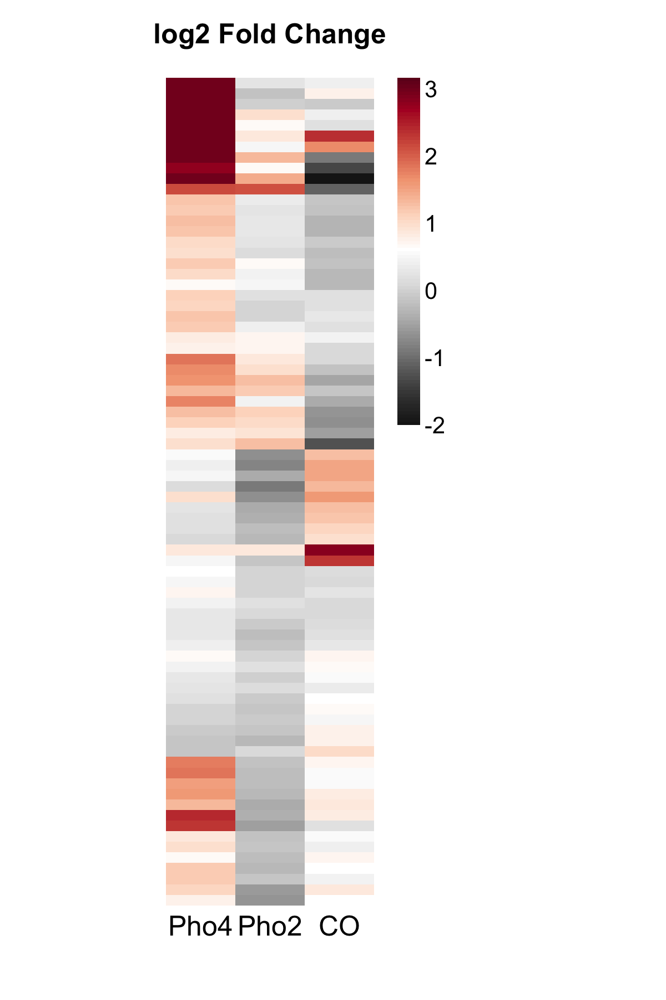
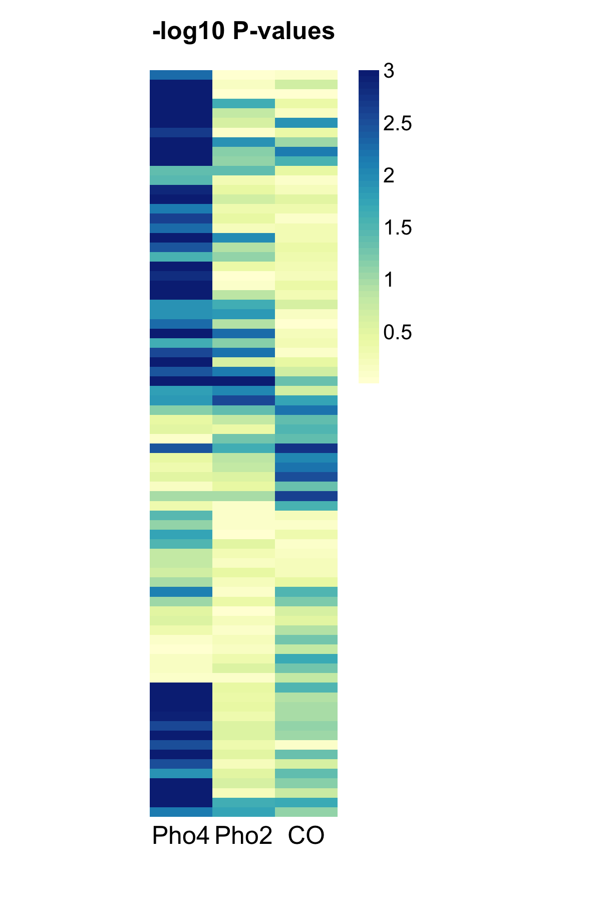
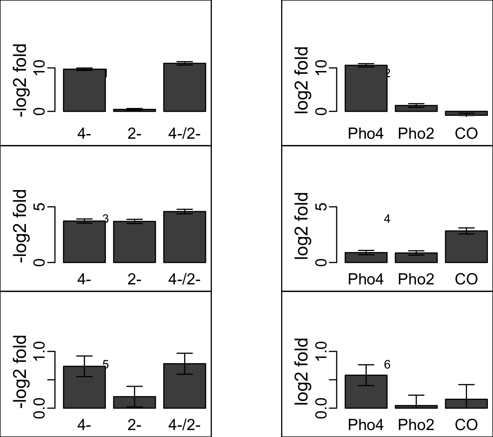

_Brief description_

This script analyzes CgPho4 binding and gene induction in its own genome background. This analysis combines RNAseq and ChIP-seq data

# Read data & Define functions

Load library packages...

```{r Load_library, message=FALSE}
library(ggplot2)      # general plotting
library(cowplot)      # Claus Wilco's modification on ggplot
library(plyr)         # for data frame manipulation
library(NMF)          # for plotting heatmaps
library(limma)        # for linear regression analysis
library(data.table)   # for handling large matrix/data.frame
library(RColorBrewer) # for color palette
#library(vsn)          # for plotting meanSdPlot
library(edgeR)        # for limma-voom workflow
library(GenomicRanges)# for GRanges object construction
## load subfunctions
source("RNAseq_subfunctions.R")
## load annotation files
source("./input/useful_anno_Robj.R")
```


# Data processing

## Load data

```{r load_data, comment=NA, cache = FALSE}
# raw data count (countTable)
raw <- fread("./input/20170121_CglaRNAseq_count.csv") # 5595 genes, 20 samples, last column is gene name
mat <- as.matrix(raw[,-1])
rownames(mat) <- raw$ORF

# sample information (colData)
sample.info <- fread("./input/20170121_CglaRNAseq_sample_info.csv")
print( sample.info )
```

```{r annotation}
# gene annotation file
anno.file <- fread("./input/C_glabrata_gene_for_mapping_2016.bed")
names(anno.file) <- c("Chr","Start","End","GeneID","Not.Use","Strand","GeneName","Type.of.Gene")
anno <- anno.file[,c("Chr","GeneID","GeneName","Type.of.Gene")]
all.genes <- anno$GeneID
#anno.gr <- with(anno.file, GRanges(seqname=Chr, ranges=IRanges( start=Start+1, end=End ), strand=Strand, gene_name=GeneName))
#names(anno.gr) <- mcols(anno.gr)$gene_name
gene.names <- ifelse(anno$GeneName == "", anno$GeneID, anno$GeneName)
cgdToName <- gene.names; names(cgdToName) <- anno$GeneID
nameToCgd <- anno$GeneID; names(nameToCgd) <- gene.names
```

## Filtering

Using total counts in all 8 samples > 50 to remove genes with low counts. Note that this criteria is arbitrary. However it doesn't alter the qualitative results. Try changing it in the code and look at the resulting figures.

```{r limma_filter_n_normalize}
# construct count matrix using the edgeR package
dge.all <- DGEList( counts = mat, genes = anno )

# keep genes that have more than 1 count per million in at least 3 samples
isexpr <- rowSums(cpm(dge.all) > 1) >= 3 # excluded 541 genes
sprintf("%d genes were removed from the dataset due to low reads count", sum(!isexpr))

# exclude PHO4 and PHO2 since these two genes are deleted in half of the strains
exclude <- all.genes == "CAGL0D05170g" | all.genes == "CAGL0L07436g"

# filter data
dge <- dge.all[isexpr & !exclude,,keep.lib.sizes=FALSE]

#prepare dataset: use TMM method to normalize
dge <- calcNormFactors(dge)
```

## Data transformation to remove mean-variance dependency
 
```{r limma_voom_transformation, fig.width=10, fig.height=5}
# construct design matrix
design <- model.matrix(~0+GT, sample.info) # 36 x 18 matrix. The rows in the design matrix correspond to the columns in the data matrix "mat". Make sure that they match each other.
colnames(design) <- sub("GT", "", colnames(design))
# apply voom transformation, plot mean-variance trend
oldpar <- par(mfcol = c(1,2))
v.dge <- voom( dge, design, plot = TRUE )
# clustering samples
plotMDS(v.dge)
par(oldpar)
# fit the linear model. the 'fit' object is to be used to extract particular "contrasts". See below
fit <- lmFit(v.dge, design)
```

## Linear Model fitting to identify differentially expressed genes

```{r linear_model_fitting, fig.height=5, fig.width=10, fig.show = 'hold'}
mut.matrix <- makeContrasts(
  Cgla4.alone = Cgla4.del2 - del4.del2,
  Cgla2.alone = del4.Cgla2 - del4.del2,
  I.cg4cg2    = (Cgla4.Cgla2 - del4.Cgla2) - (Cgla4.del2 - del4.del2),
  levels = design
)

# Instead of analyzing all genes, focus on the subset that show strong evidence of 
# extract the "contrasts"
# first, plot the mutant cycle estimates for putative targets
#  1. fit a mutant cycle model
fit.mut <- contrasts.fit( fit, mut.matrix )
fit.mut <- eBayes( fit.mut )
sig.mut <- decideTests( fit.mut, p.value = 0.05, method = "separate")
use <- apply(sig.mut, 1, function(x) sum( x == 1 ) > 0 )

#  2. plot heatmap
## effect size in log2
what <- coef(fit.mut[use,])
what <- ifelse(what > 4, 4, ifelse(what < -2, -2, what))
colnames(what) <- c("Pho4p","Pho2p","CO")
od <- order(5*what[,"Pho4p"]+what[,"CO"], decreasing = TRUE)

## log10 p-value
what1 <- -log10(fit.mut$p.value[use,])
what1 <- ifelse(what1 > 3, 3, what1)
colnames(what1) <- c("Pho4p","Pho2p","CO")
color <- colorRampPalette(brewer.pal(8,"YlGnBu"))(49)

oldpar <- par(mfcol = c(1,2))

aheatmap( what, breaks = 1, border_color = NA, revC = TRUE, Rowv = od, Colv = NA, labRow = NA, cellwidth = 30, main = "log2 Fold Change", fontsize = 10 )
aheatmap( what1, color = color, border_color = NA, revC = TRUE, Rowv = od, Colv = NA, labRow = NA, cellwidth = 30, main = "-log10 P-values", fontsize = 10 )

par(oldpar)
```

# Generate figures

## Generate Figure 5B (heatmap)

```{r Figure5_B}
# Instead of analyzing all genes, focus on the ones with strong evidence of CgPho4 binding and CgPho4-dependent gene induction. This list is stored in the file "20170108_allin1_table.txt"
Cgla4.IP.allIn1 <- fread("./input/20170108_allin1_table.txt")
# choose genes that are considered high or medium confidence based on ChIP
direct.target <- Cgla4.IP.allIn1[Fun_4 > 0 & Bind4 > 0, GeneID] # 81 entries, however, there is a duplicate, hence 80 unique genes
n1 <- which(fit$genes$GeneID %in% direct.target) # 79 genes recorded, one is removed because it is a tRNA gene

# first, plot the mutant cycle estimates for putative targets
#  1. fit a mutant cycle model
fit.mut <- contrasts.fit( fit[n1,], mut.matrix )
fit.mut <- eBayes( fit.mut )
sig.mut <- decideTests( fit.mut, p.value = 0.05, method = "separate")

#  2. plot
par( oma = c(0,0,0,0), mar = rep(0,4) )
what <- coef(fit.mut)
what <- ifelse(what > 3, 3, ifelse(what < -2, -2, what))
colnames(what) <- c("Pho4","Pho2","CO")
p1 <- aheatmap( what, breaks = 0.58, color = "-RdGy:100", border_color = NA, hclustfun = "ward", revC = F, Rowv = F, Colv = NA, labRow = NA, treeheight = 50, cellwidth = 30, main = "log2 Fold Change", fontsize = 10, filename = "./figure_output/Figure_5B_1.png", width = 4, height = 6) # use 0.58 (=log2(1.5)) as the separating point

par( mar = rep(0,4) )
what1 <- -log10(fit.mut$p.value)
what1 <- ifelse(what1 > 3, 3, what1)
colnames(what1) <- c("Pho4","Pho2","CO")
color <- colorRampPalette(brewer.pal(8,"YlGnBu"))(49)
aheatmap( what1, color = color, border_color = NA, revC = F, Rowv = p1$rowInd, Colv = NA, labRow = NA, cellwidth = 30, main = "-log10 P-values", fontsize = 10, filename = "./figure_output/Figure_5B_2.png", width = 4, height = 6 )
```

 

## Generate Figure 5C (components, not full figure)

```{r Figure_5C}
# define constrasts: the first three are to illustrate the intermediate estimates for generating the expression components (the next three)
illustrate.matrix <- makeContrasts(
  Cgla4 = Cgla4.Cgla2 - del4.Cgla2,
  Cgla2 = Cgla4.Cgla2 - Cgla4.del2,
  Both  = Cgla4.Cgla2 - del4.del2,
  Cgla4.alone = Cgla4.del2 - del4.del2,
  Cgla2.alone = del4.Cgla2 - del4.del2,
  I.cg4cg2    = (Cgla4.Cgla2 - del4.Cgla2) - (Cgla4.del2 - del4.del2),
  levels = design
)

# model fitting
fit.show <- contrasts.fit( fit[n1,], illustrate.matrix )
fit.show <- eBayes( fit.show )
sig.show <- decideTests( fit.show, p.value = 0.05, method = "separate")

# define plotting function
error.bar <- function(x, y, upper, lower=upper, length=0.07,...){ 
  if(length(x) != length(y) | length(y) !=length(lower) | length(lower) != length(upper))
    stop("vectors must be same length")
  arrows(x,y+upper, x, y-lower, angle=90, code=3, length=length, ...)
}

myIllusPlot <- function(gene, fit = fit.show){
  stopifnot( gene %in% fit$genes$GeneID )
  x <- coef(fit)[gene,]
  y <- fit$stdev.unscaled[gene,]
  names(x) <- c("4-","2-","4-/2-","Pho4","Pho2","CO")
  barx1 <- barplot(x[1:3], col = rgb(.3,.3,.3), ylab = "-log2 fold", ylim = c(min(c(0,min(x[4:6])*1.4)-0.2),max(x[1:3])*1.4)+0.2)
  error.bar(barx1, x[1:3], y[1:3])
  barx2 <- barplot(x[4:6], col = rgb(.3,.3,.3), ylab = "log2 fold", ylim = c(min(c(0,min(x[4:6])*1.4)-0.2),max(x[1:3])*1.4)+0.2)
  error.bar(barx2, x[4:6], y[4:6])
  #title(main = gene)
}

# generate plots: 3 genes, 2 subplots
genes.to.plot <- c("Pho4 dominant" = "CAGL0B02475g",
                   "CO dominant"   = "CAGL0J04202g",
                   "Weakly 1"      = "CAGL0M10829g")

# design layout and pick 3-5 genes to plot
png(filename = "./figure_output/Figure_5C.png", width = 4.5, height = 4, units = "in", res = 300, bg = "transparent")
layout(mat = matrix(c(1,3,5,0,0,0,2,4,6), ncol = 3), widths = c(3,1,3))
par( mar = c(2,4,3,0), lab = c(2,2,3), mgp = c(2,0.5,0.2), cex.lab = 1.5, cex.axis = 1.3 )
layout.show(6) # check the layout on the screen
for( g in genes.to.plot ){
  myIllusPlot(g)
}
dev.off()

# plot all 79 genes for overview
pdf("./figure_output/test.pdf", width = 6, height = 2)
layout(mat = matrix(c(1,0,2), ncol = 3), widths = c(2,1,2))
tmp <- sapply(fit.show$genes$GeneID, myIllusPlot)
dev.off()
```

